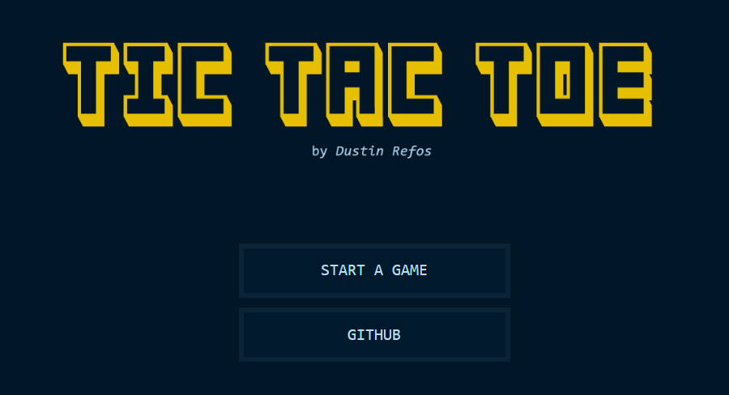

## Tic Tac Toe React

As part of my Software Engineering course in year 1, semester 2 at UNASAT (University of Applied Sciences and Technology Suriname) I had to build a Tic Tac Toe game in Java which is connected to a local MySQL database. The period in which the first working version was completed was from  April 4 to 8, 2024.

## 1. Steps and requirements
Take the following steps to play this game or work on this project:
- You will need an IDE to run this, I prefer [IntelliJ](https://www.jetbrains.com/idea/download/).
- A laptop/PC with [JDK 17](https://download.oracle.com/java/17/latest/jdk-17_windows-x64_bin.exe) or newer installed.
- MySQL database management software. You can use [MySQL Workbench](https://dev.mysql.com/downloads/workbench/). After this, import the database structure using the instructions below.
- Finally, pull this project into IntelliJ and run it.