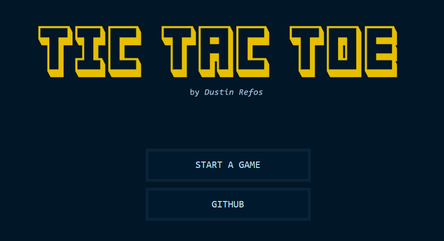
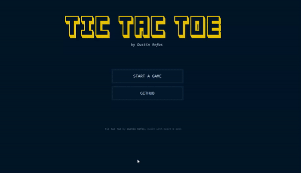

## Tic Tac Toe React (Still in development)
<p align="center">

</p>

As part of my Software Engineering course in year 1, semester 2 at UNASAT (University of Applied Sciences and Technology Suriname) I had to build a [Tic Tac Toe game in Java](https://github.com/DustinVII/TicTacToe). I decided to recreate this game in React in order to learn the basics of React.

<p align="center">

</p>


## Steps and requirements
Take the following steps to play this game or work on this project.


### Method 1
1. Install `node.js`. [Download node.js here](https://nodejs.org/en/download/package-manager) and `npm`. [Check this link](https://docs.npmjs.com/downloading-and-installing-node-js-and-npm)

2. Check node and npm version in command using `node -v` and `npm -v`
3. Install dependencies using `npm install`
4. Start node server in a new terminal:
```bash
cd node
node server.js
```
5. Go to the root of your project and run the development server `npm start`
6. Your React app will automatically open in your browser at: `http://localhost:3000`


### Method 2 (fastest)
1. Upload the project on a local web server.
2. Run `index.html` in your browser.